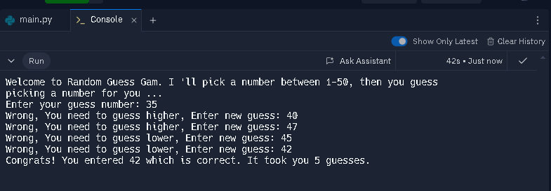

## Create Ramdon Guess Game
This project is begineer friend and test your skills on logic using while loop, if statments, input and more.

Task: create  simple game that get user input , compares with random number generated , Continue until user enters the right number then output user the answer and number of times they guessed

#### Follow the Instruction below:
- [x] import the random library 
- [x] Get User input , ensure to convert user input to INT
- [x] while user input isnot same as the random number generated, 
- [x] Display user status and get new guess
- [x] Optionally, you can import time and add some breaks using `time.sleep(1)`

Give this a try below proceeding to main.py

